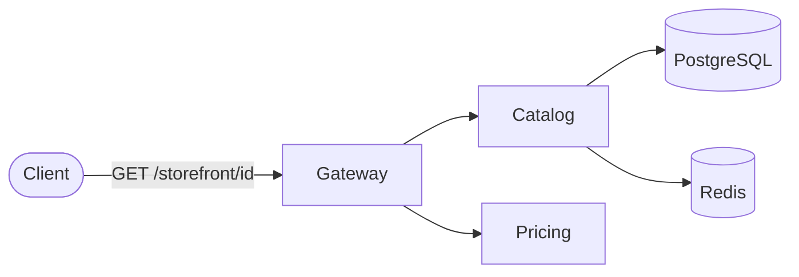
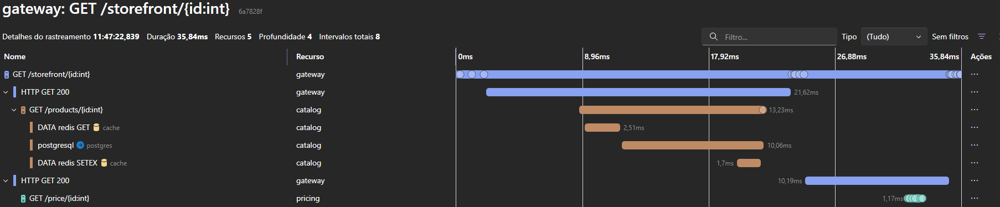

# dotnet-aspire-reference

Aplicação distribuída de referência construída com .NET Aspire: três serviços (Gateway, Catalog e Pricing) com Postgres e Redis, orquestrados pelo AppHost. O objetivo é demonstrar como o Aspire resolve service discovery, conexão com os bancos, health checks e OpenTelemetry sem a configuração manual que esse tipo de integração normalmente exige.

Complementa o [observability-from-scratch](https://github.com/thomasmoreira/observability-from-scratch), onde a observabilidade é montada manualmente. Aqui o mesmo objetivo é alcançado pelo caminho do Aspire.

[](https://github.com/thomasmoreira/dotnet-aspire-reference/actions/workflows/ci.yml)

## Visão geral



- **AppHost** declara os serviços, o Postgres e o Redis em C# e orquestra a subida de tudo.
- **Gateway** recebe a request e chama o Catalog e o Pricing por service discovery, sem URLs no código.
- **Catalog** lê os produtos do Postgres, com cache no Redis.
- **Pricing** retorna o preço de um produto.
- **ServiceDefaults** centraliza OpenTelemetry, health checks, service discovery e resiliência, reaproveitados por todos os serviços.

Uma chamada em `GET /storefront/{id}` passa pelo Gateway, consulta o Catalog (Postgres e Redis) e o Pricing. Como todos os serviços exportam OpenTelemetry, a request aparece como um único trace no dashboard do Aspire:



São 8 spans cruzando os cinco recursos em uma única request. A propagação de contexto é automática, já que o HttpClient é instrumentado pelos ServiceDefaults; não há código de plumbing para isso.

## Como rodar

Pré-requisitos: .NET 10 e Docker (o Aspire executa o Postgres e o Redis como containers).

```bash
dotnet new install Aspire.ProjectTemplates   # apenas na primeira vez
dotnet run --project src/AppHost
```

O console imprime a URL do dashboard, e as portas dos serviços ficam listadas nele. Para visualizar o trace, faça uma request no Gateway e abra a aba Traces:

```bash
curl http://localhost:<porta-do-gateway>/storefront/1
```

### Endpoints

| Serviço | Endpoint | Descrição |
|---|---|---|
| Gateway | `GET /storefront/{id}` | Compõe Catalog e Pricing em um único item |
| Gateway | `GET /storefront` | Lista completa, com o preço de cada item |
| Catalog | `GET /products` · `GET /products/{id}` | Produtos do Postgres; a busca por id passa pelo cache do Redis |
| Pricing | `GET /price/{id}` | Preço do produto |

### Testes

```bash
dotnet test
```

Os testes usam o `Aspire.Hosting.Testing`, que sobe a aplicação completa com os containers e exercita os endpoints reais, sem mocks.

## Estrutura

```
src/
  AppHost/          orquestração: Postgres, Redis e os três serviços
  ServiceDefaults/  OpenTelemetry, health checks, service discovery e resiliência
  Gateway/          compõe Catalog e Pricing por service discovery
  Catalog/          produtos no Postgres com cache no Redis
  Pricing/          preço por produto
tests/
  AppHost.Tests/    sobe a aplicação e testa o fluxo de ponta a ponta
docs/adr/           registro das decisões
```

## Decisões

As decisões principais estão registradas em `docs/adr/`:

- [ADR-001 — Aspire como orquestrador](docs/adr/ADR-001-aspire-orchestration.md)
- [ADR-002 — Comunicação HTTP síncrona](docs/adr/ADR-002-sync-http-communication.md)
- [ADR-003 — Service discovery e resiliência via ServiceDefaults](docs/adr/ADR-003-servicedefaults.md)
- [ADR-004 — Apenas o dashboard do Aspire](docs/adr/ADR-004-aspire-dashboard.md)
- [ADR-005 — Testes com Aspire.Hosting.Testing](docs/adr/ADR-005-apphost-testing.md)

O dashboard do Aspire é voltado para desenvolvimento. Em produção, a telemetria seria exportada para um backend dedicado (Tempo, Prometheus, Loki), abordagem usada no observability-from-scratch.
