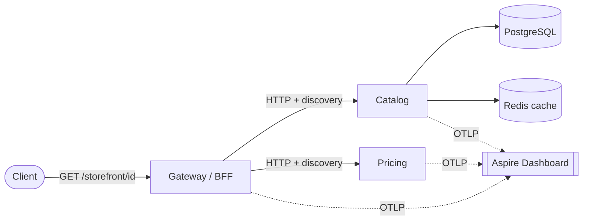

# dotnet-aspire-reference

> **.NET Aspire** orquestrando uma app distribuída — 3 serviços + Postgres + Redis — com
> **service discovery, resiliência, health e OpenTelemetry** padronizados, e o **dashboard
> pronto** mostrando um **trace distribuído atravessando os 3 serviços numa request real**.

[](https://github.com/thomasmoreira/dotnet-aspire-reference/actions/workflows/ci.yml)

---

## A tese

O lab [`observability-from-scratch`](https://github.com/thomasmoreira/observability-from-scratch)
montou os três pilares da observabilidade **na mão** e terminou dizendo *"em produção você
usaria Aspire"*. **Este lab é a versão Aspire.** Juntos provam o mesmo ponto pelos dois lados:

> Entendo a mecânica por baixo (OTel na mão, Collector, LGTM) **e** sei usar a ferramenta
> moderna que a abstrai (Aspire: orquestração, discovery, resiliência e telemetria padronizados).

## Arquitetura



Uma request em `GET /storefront/{id}` no **Gateway** dispara chamadas ao **Catalog** (lê o
Postgres, cacheia no Redis) e ao **Pricing**, gerando **um único trace** que cruza os três
serviços — visível no dashboard do Aspire.

## Componentes

| Projeto | Papel |
|---|---|
| **AppHost** | Orquestrador em C#: declara Postgres, Redis e os serviços, com `WithReference` + `WaitFor`. |
| **ServiceDefaults** | `AddServiceDefaults()`: OpenTelemetry + health + service discovery + resiliência HTTP, numa linha por serviço. |
| **Gateway** (BFF) | API pública; chama Catalog + Pricing **por nome** (service discovery), com `HttpClient` resiliente. |
| **Catalog** | Produtos no Postgres + cache no Redis (integrações Aspire com telemetria/health embutidos). |
| **Pricing** | Preço por produto — o terceiro hop do trace. |

## O killer detail — trace distribuído

No dashboard do Aspire → **Traces**, uma request a `/storefront/{id}` aparece como **um único
trace** com spans aninhados cruzando os 3 serviços:

```
GET /storefront (Gateway)
└─ GET /products/{id} (Catalog)
   ├─ db query (Postgres)
   └─ cache get (Redis)
└─ GET /price/{id} (Pricing)
```

A propagação de contexto (W3C `traceparent`) é automática — o `HttpClient` é instrumentado
pelos ServiceDefaults, sem código de plumbing.

## Sinais de arquiteto

- **Service discovery** — serviços se acham por nome (`https+http://catalog`), zero URL hardcoded.
- **Resiliência** — retry + circuit breaker por padrão (Polly via ServiceDefaults).
- **`WaitFor`** — um serviço só sobe quando sua dependência está saudável.
- **AppHost testável** — `Aspire.Hosting.Testing` sobe a composição distribuída num teste real.

## Como rodar

**Pré-requisitos:** .NET 10 SDK e Docker (o Aspire roda Postgres/Redis como containers).

```bash
# templates do Aspire (uma vez)
dotnet new install Aspire.ProjectTemplates

# sobe os serviços + Postgres + Redis + dashboard
dotnet run --project src/AppHost
#   → o console imprime a URL do dashboard (com token de login)

# verificação ao vivo (sobe a app inteira num teste, valida o fluxo, e dá teardown limpo)
dotnet test
```

## Decisões de arquitetura

- [ADR-001 — Aspire como orquestrador](docs/adr/ADR-001-aspire-orchestration.md)
- [ADR-002 — Comunicação HTTP síncrona](docs/adr/ADR-002-sync-http-communication.md)
- [ADR-003 — Service discovery + resiliência via ServiceDefaults](docs/adr/ADR-003-servicedefaults.md)
- [ADR-004 — Dashboard do Aspire (sem export externo)](docs/adr/ADR-004-aspire-dashboard.md)
- [ADR-005 — Verificação via Aspire.Hosting.Testing](docs/adr/ADR-005-apphost-testing.md)

> **Em produção**, o dashboard do Aspire é para desenvolvimento — você exportaria OTLP para
> backends gerenciados (Tempo/Prometheus/Loki, como no lab `observability-from-scratch`).
> Aqui o foco é o que o Aspire entrega de graça (ADR-004).

---

_Lab de portfólio. Foco: .NET Aspire, orquestração, service discovery, resiliência, OpenTelemetry e o trace distribuído._
